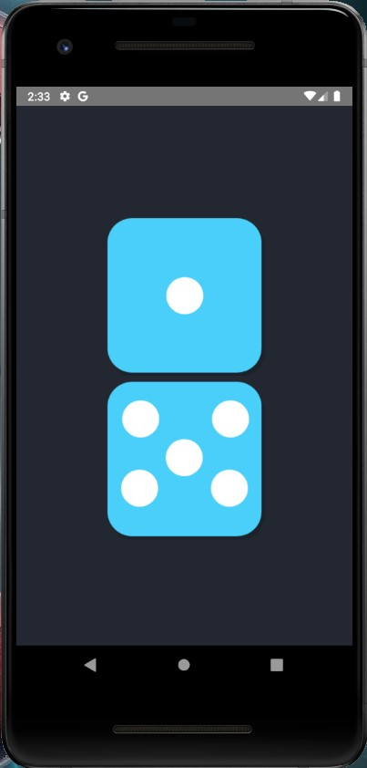

# Dice Roller App

This is a simple Dice roller App developed using React Native.

## Topics Learned

- Using StyleSheet, to style the components.
- React native elements like `View`, `Text`, `Image`, `TouchableOpacity`.
- How to use images in the app.

## Images

