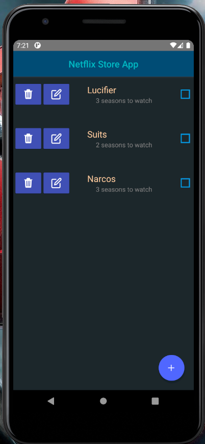
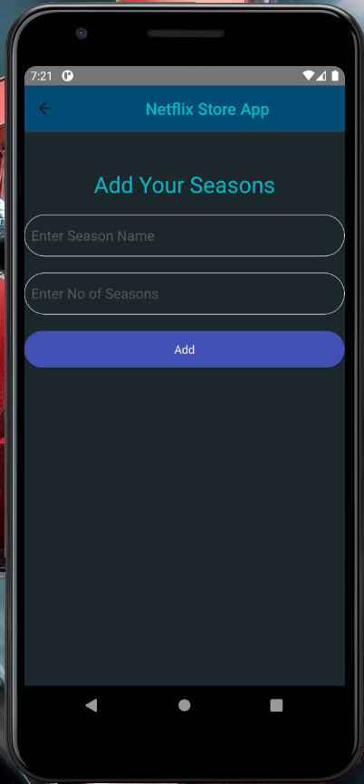
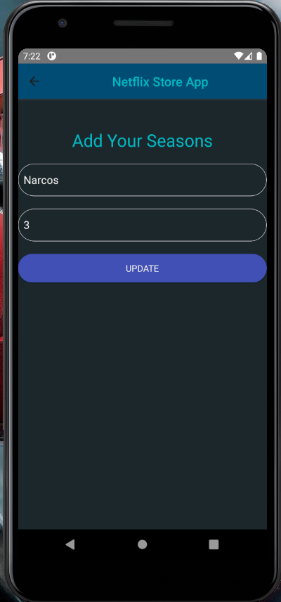

# Netflix Store

This is Simple Todo type ToWatch App, which tells, how many shows to watch in a Series.

## Dependencies

- [React-Native-Navigation](https://reactnavigation.org/) (For navigation between screens).
- [ShortId](https://www.npmjs.com/package/shortid) (To create shortId's for shows).
- [Native-Base](https://nativebase.io/) (It's like a bootstrap kinda for react-native).
- [React-Native-Community/async-storage](https://www.npmjs.com/package/@react-native-async-storage/async-storage) (To store into localstorage Async)

## What is this?

- This is a simple Watchlist App, where user can add Tv shows which he/she willing to watch.
- We are storing the values locally at present, but we can use DB.
- User can Add, Edit, Delete, Check mark the items.

## Screens

### Home Screen

### Item Add Screen

### Item Edit Screen

