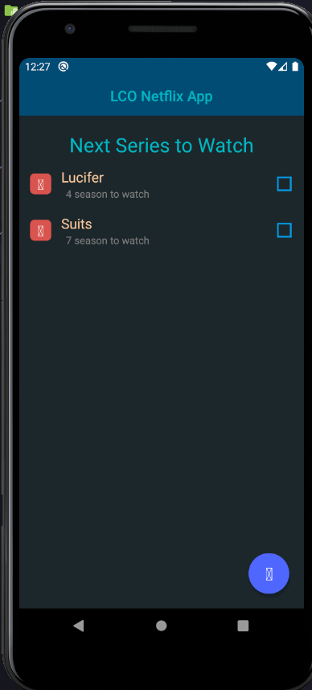
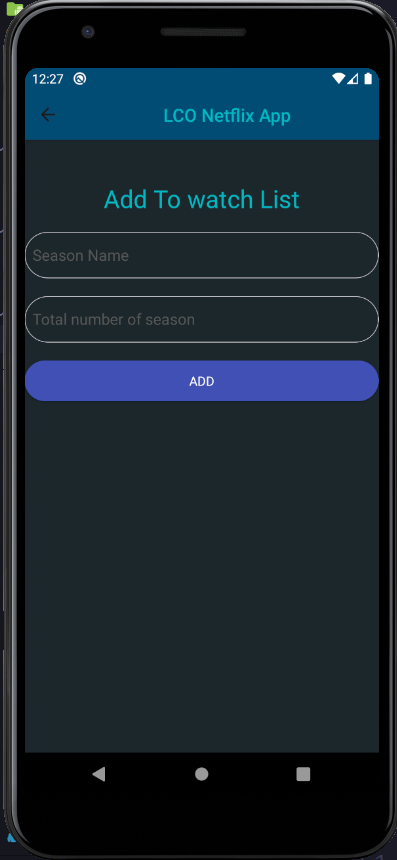

# Movie Watchlist App with Redux

This app is developed using redux for keeping our state in a central place.

## Dependencies

- [React-Redux](https://redux.js.org/) (Used to store state in central place).
- [Native-Base](https://nativebase.io/) (This is kinda of bootstrap for react-native).
- [react-native-vector-icons](https://www.npmjs.com/package/react-native-vector-icons) (for icons).
- [React-Navigation](https://reactnavigation.org/) (To navigate between screens).
- [ShortId](https://www.npmjs.com/package/shortid) (To generate shortIds for every list item).

## Screens

Home Screen

Add Screen

