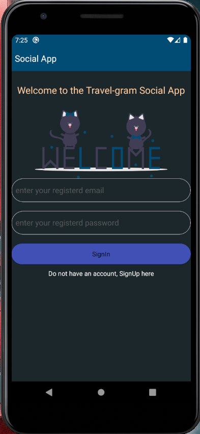
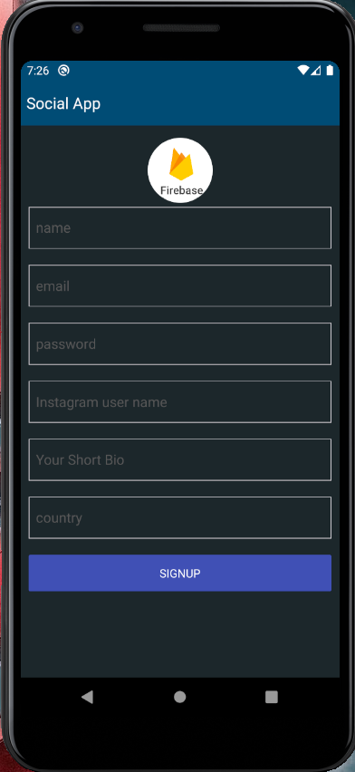
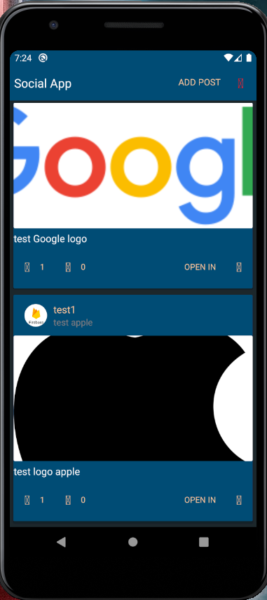
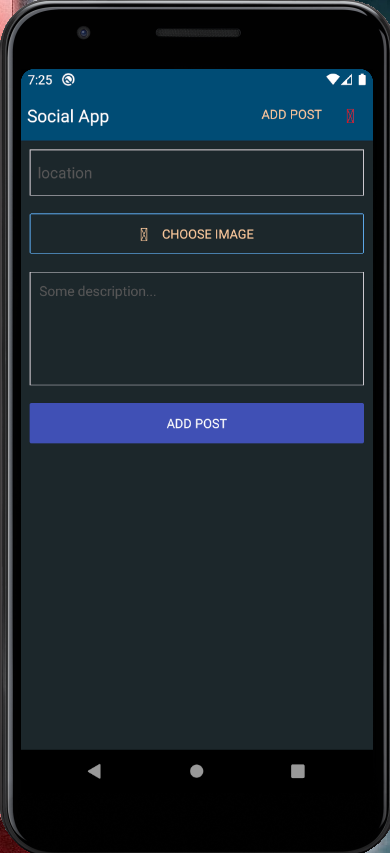

# Social App

This app is inspired by Instagram. In this app user can add posts, like/dislike posts.

## Dependencies Used

- [React Native Image Picker](https://www.npmjs.com/package/react-native-image-picker)
- [Snackbar](https://www.npmjs.com/package/react-native-snackbar)
- [React Native Firebase](https://rnfirebase.io/)
- [React Native Vector Icons](https://www.npmjs.com/package/react-native-vector-icons)
- [React Redux](https://react-redux.js.org/)
- [Native Base](https://nativebase.io/)
- [Shortid](https://www.npmjs.com/package/shortid)
- [Prop Types](https://www.npmjs.com/package/prop-types)

## Screens

Sign In Screen



Sign Up Screen



Home Screen



AddPost Screen



## How to run App

- Firstly, generate app using `npx react-native init <App Name>` command.
- Second, generate firebase app using [Firebase Console](https://console.firebase.google.com/), while generating app include your app name which is present in `android/app/src/main/AndroidMainfest.xml` file.

```js
<manifest xmlns:android="http://schemas.android.com/apk/res/android"
  package="com.socialapp">
```

- After, that add `google-services.json` file which is generated while initializing firebase app.
- Next, do as prescribed in the documentation of [React Native Firebase](https://rnfirebase.io/).
- Next, install necessary dependencies using `npm install`.
- Next, run the metro server using `npx react-native start`.
- Next, generate the android/ios app using

```js
//for andriod
npx react-native run-android

//for ios
npx react-native run-ios
```

## Note:

- There is a problem in the icons, thats why icons are not loading in the screenshots.
